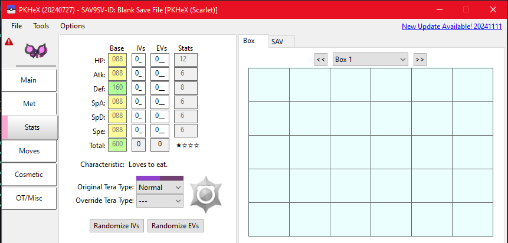
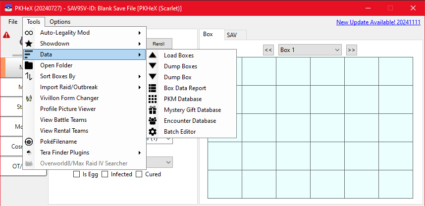
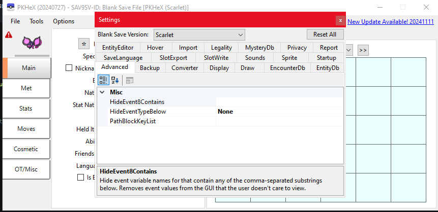

# PKHeX ALL-IN-ONE

### By PKM-Universe

**A customized Pokémon save editor with enhanced features, plugins, and custom theme.**

[Download](https://github.com/PKM-Universe/PKHeX-ALL-IN-ONE/releases/latest) • [Discord](https://discord.gg/pkm-universe) • [Ko-fi](https://ko-fi.com/pokemonlover8888) • [Wiki](https://github.com/PKM-Universe/PKHeX-ALL-IN-ONE/wiki) • [Report Bug](https://github.com/PKM-Universe/PKHeX-ALL-IN-ONE/issues/new?template=bug_report.md)

---

## ✨ Features

| Feature | Description |
|---------|-------------|
| 🎨 **Custom Red Theme** | Sleek, modern interface with PKM-Universe branding |
| ⚡ **Auto-Legality Mod** | Automatically make any Pokémon legal with one click |
| 📦 **Batch Editor** | Edit multiple Pokémon at once |
| 🔄 **Showdown Import/Export** | Full Pokémon Showdown compatibility |
| 🎁 **Mystery Gift Database** | Access all event Pokémon |
| 🗺️ **Encounter Database** | Find wild encounter data |
| 📚 **Living Dex Generator** | Build your complete Pokédex |
| 🔍 **Seed Finders** | Find seeds for SV, SWSH, and more |

---

## 🎮 Supported Games

| Generation | Games |
|------------|-------|
| Gen 9 | Scarlet & Violet, Legends Z-A |
| Gen 8 | Sword & Shield, BDSP, Legends Arceus |
| Gen 7 | Sun & Moon, Ultra Sun & Ultra Moon, Let's Go |
| Gen 6 | X & Y, ORAS |
| Gen 5 | Black & White, B2W2 |
| Gen 4 | Diamond & Pearl, Platinum, HGSS |
| Gen 3 | Ruby & Sapphire, Emerald, FRLG |
| Gen 1-2 | Red, Blue, Yellow, Gold, Silver, Crystal |

---

## 📥 Installation

1. Download the latest release from [Releases](https://github.com/PKM-Universe/PKHeX-ALL-IN-ONE/releases/latest)
2. Extract the ZIP file
3. Run `PKHeX.exe`
4. Plugins are included in the `plugins` folder!

---

## ⚙️ Settings

---

## 🔧 Build Requirements

- .NET 9.0
- Visual Studio 2022 or later

---

## 🤝 Credits

- Original PKHeX by [kwsch](https://github.com/kwsch/PKHeX)
- Auto-Legality Mod by [architdate](https://github.com/architdate/PKHeX-Plugins)
- Customizations by **PKM-Universe**

---

### Made with ❤️ by PKM-Universe

